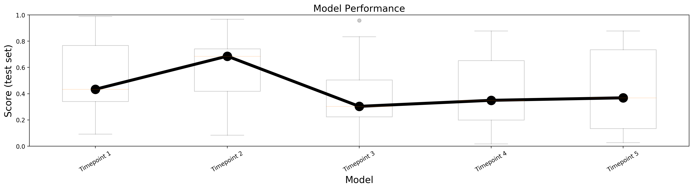
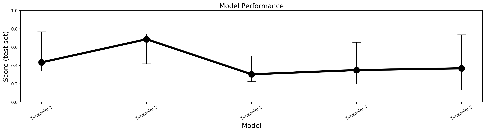

# Visualizing model performance with boxplots
How to plot multiple boxplots in the same figure. Useful when we need to visualize the mean/median model performance, along with variability (standard deviation/interquantile range).
Let us assume we have a number of trained models and we want to assess how they perform
on the same intependent test set using a performance metric, such as accuracy, Dice, AUC, etc.

## Independent models
When evaluating independent models it is useful to plot their performance as a 
boxplot. Boxplots are a convenient way to visualize the variability of a model's
performance on a set of datapoints (that comprise the test set). [Box plots](https://en.wikipedia.org/wiki/Box_plot) Visualize the 25th and 75th percentiles of the data distribution as a box, while the median is marked as a horizontal line inside the box. The whiskers can have several different meanings, but the most common (and the one used by default in [matplotlib](https://matplotlib.org/3.1.0/api/_as_gen/matplotlib.pyplot.boxplot.html)) is encompassing all datapoints lying in at most +- 1.5 times the Inter-Quantile-Range (IQR). IQR corresponds to the distance between the 25th and 75th percentiles (i.e., the height of the box).

If we prefer a cleaner look, we can only plot the medians, along with error-bars
that correspond to the 25th and 75th percentile (showing the interquantile range)

The performance of different models can be visualized via boxplots as follows:

**Figure 1.** Visualizing the performance of independent models via boxplots.

**Figure 2.** Visualizing the performance of independent models via median+error bars corresponding to the interquantile range (the 25th and 75th percentiles).

## Dependent models
Sometimes we want to visualize a series of dependent models. E.g. how the performance
of a model changes after training for additional epochs, or after adding new datapoints
to the training set. In this case, it is convenient to visualize this continuity
by connecting the boxplots. In this example, we connect the boxplots by drawing a 
line that connects the medians

Similarly, we can connect the medians of the cleaner plot that only visualizes
the median and the interquantile range.

**Figure 3.** Visualizing the performance of dependent models via boxplots.

**Figure 4.** Visualizing the performance of dependent models via median+error bars corresponding to the interquantile range (the 25th and 75th percentiles). This cleaner plot is preferable if we intend to plot a number of different lines (corresponding to different sets of dependent models) on top of each other.

The plots are generated using artificial data. All plots are created in generate_plot.py.

## About
Personal website: https://users.isc.tuc.gr/~nchlis/

For tutorials on Machine Learning projects you can visit
- https://nchlis.github.io/
- https://github.com/nchlis/

